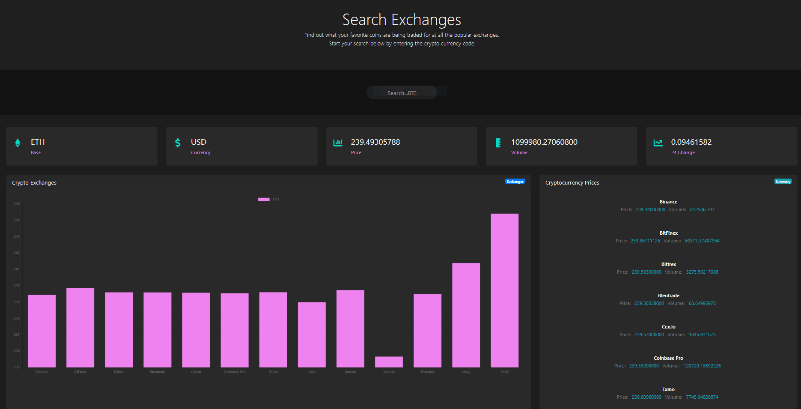

# Crypto Exchanges - cryptocurrency exchange search app

Crypto Exchanges is a simple search app that returns the current rates at various exchanges for comparison. 
This app was created as training project as well as a simple way to check the value of cryptocurrencies at multiple exchanges. 



## Technologies

* Bootstrap 4
* Chartjs 2.9.3
* Webpack 4
* Vanilla JavaScript

### Installation

This app requires [Node.js](https://node.js.org/) v14.4.0 to run. 

To run this project, install it locally and install the dependencies using npm, then start the dev server:

```sh
$ cd ../crypto-exchanges
$npm install
$npm run serve
```

For production build....

```sh
$npm run build
```

##### Todos

- Write tests 
- Optimize build size
- Enhance chart reposiveness 
